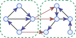

# Symbolic method and directed graph enumeration

[论文链接](https://arxiv.org/abs/1903.09454)

## 2. 符号化方法

### 2.1 定义

考虑一个序列 $(a_n(w))_{n=0}^\infty$，定义它的 EGF 和 GGF 为

$${\rm A}(z,w)=\sum_{n\ge0}a_n(w)\frac{z^n}{n!}\quad\text{and}\quad{\bf A}(z,w)=\sum_{n\ge0}\frac{a_n(w)}{(1+w)^\binom n2}\frac{z^n}{n!}.$$

*注：这个序列里每个元素都是一个级数。注意它和通常定义的序列 $(a_n)_{n=0}^\infty$ 的区别*

为了区分 EGF 和 GGF，后者会使用粗体。将 $w=1$ 代入一个 GGF，可以得到它对应的**特殊生成函数**。一个级数 $A(z)$ 关于 $z$ 的 $n$ 次项系数记做 $[z^n]A(z)$，所以 $A(z)=\sum_{n\ge0}([z^n]A(z))z^n$。

两个级数 $A(z)=\sum_{n\ge0}a_n\frac{z^n}{n!}$ 和 $B(z)=\sum_{n\ge0}b_n\frac{z^n}{n!}$ 的**指数型 Hadamard 积**定义为

$$A(z)\odot B(z)=\left(\sum_{n\ge0}a_n\frac{z^n}{n!}\right)\odot\left(\sum_{n\ge0}b_n\frac{z^n}{n!}\right)=\sum_{n\ge0}a_nb_n\frac{z^n}{n!}.$$

所有的 Hadamard 积都是关于 $z$ 的。Hadamard 积可以用来转换 EGF 和 GGF（见 `推论 3.2`）。指数型 Hadamard 积不应该和普通 Hadamard 积混淆，其中普通 Hadamard 积是 $\sum_n([z^n]A(z))([z^n]B(z))z^n$。

如果 $\mathcal A$ 是某图族或有向图族，我们可以将一个级数序列 $(a_n(w))_n^\infty$ 与其关联，使得 $[w^m]a_n(w)$ 等于 $\mathcal A$ 中 $n$ 个点 $m$ 条边的元素个数。因此，我们可以将 EGF 和 GGF 都关联到相同的图族或有向图族。

*再次注意，是级数序列，每一个元素都是级数的那种 = =*

符号化方法的一个优点是它能跟踪组合对象中的参数集合。两个默认的参数是点数和边数，并且生成函数 $F(z,w)$ 中的 $z,w$ 与它们对应。作为一般化，我们考虑多元生成函数

$${\rm A}(z,w,\textbf{\textit u})=\sum_{n,\textbf{\textit p}}a_{n,\textbf{\textit p}}(w)\textbf{\textit u}^\textbf{\textit p}\frac{z^n}{n!}\quad\text{and}\quad{\bf A}(z,w,\textbf{\textit u})=\sum_{n,\textbf{\textit p}}\frac{a_{n,\textbf{\textit p}}(w)\textbf{\textit u}^\textbf{\textit p}}{(1+w)^\binom n2}\frac{z^n}{n!}.$$

其中 $\textbf{\textit u}=(u_1,\ldots,u_d)$ 是未知数向量，$\textbf{\textit p}=(p_1,\ldots,p_d)$ 是参数向量，并且使用了记号 $\textbf{\textit u}^\textbf{\textit p}=\prod_ku_k^{p_k}$。

## 2.2 组合操作

下一个命题回顾了 EGF 的经典操作，并自然地拓展到了 GGF。

**命题 2.1** 考虑两个有向图（或一般图）族 $\mathcal A$ 和 $\mathcal B$：

- 它们的不交并的 EGF 和 GGF 分别是 ${\rm A}(z,w)+{\rm B}(z,w)$ 和 ${\bf A}(z,w)+{\bf B}(z,w)$。
- 其中一个点被区分（可以理解成有根）的 EGF 和 GGF 分别是 $z\partial_z{\rm A}(z,w)$ 和 $z\partial_z{\bf A}(z,w)$。  
    *注：原文写的是 $z\partial_z{\rm A}(z)$ 和 $z\partial_z{\bf A}(z,w)$，疑似有误？*
- 若干张 $\mathcal A$ 中的有向图组成的集合的 EGF 是 $e^{{\rm A}(z,w)}$。
- $\mathcal A$ 和 $\mathcal B$ 的笛卡尔积的 EGF 是 ${\rm A}(z,w){\rm B}(z,w)$。
- 如果变量 $u$ 在 EGF ${\rm A}(z,w,u)$ 或 GGF ${\bf A}(z,w,u)$ 标记了 $\mathcal A$ 中特定项目的出现次数，那么 $\mathcal A$ 的子集的 EGF 和 GGF 是 ${\rm A}(z,w,u+1)$ 和 ${\bf A}(z,w,u+1)$。把 $u$ 替换成 $u-1$ 对应了一个容斥操作。

**定义 2.2** 我们定义 $\mathcal A$ 和 $\mathcal B$ 的 **arrow product** 为一个包含图对 $(a,b)$ 的族 $\mathcal C$，其中 $a\in\mathcal A,b\in\mathcal B$（对图进行了重标号，使得 $a,b$ 有不交的标号），且 $a,b$ 之间有任意的，从 $a$ 到 $b$ 的有向边。

  
图一：arrow product。点的标号省略。

**命题 2.3** $\mathcal A$ 和 $\mathcal B$ 的 arrow product 的 GGF 等于 ${\bf A}(z,w){\bf B}(z,w)$。

**证明** 考虑两个有向图族 $\mathcal A$ 和 $\mathcal B$，以及它们对应的序列 $(a_n(w)),(b_n(w))$。然后 ${\bf A}(z,w){\bf B}(z,w)$ 对应的序列是

$$c_n(w)=(1+w)^\binom n2n![z^n]\left(\sum_k\frac{a_k(w)}{(1+w)^\binom k2}\frac{z^k}{k!}\right)\left(\sum_l\frac{b_l(w)}{(1+w)^\binom l2}\frac{z^l}{l!}\right)=\binom nk\sum_{k+l=n}(1+w)^{kl}a_k(w)b_l(w)$$

这个级数有如下的组合解释：它是一个 $n$ 个点的图的生成函数（变量 $w$ 标记边数），由下面的方法获得：

- 从 $\mathcal A$ 中选一个大小为 $k$ 的有向图 $a$，$\mathcal B$ 中选一个大小为 $l$ 的有向图 $b$，使得 $k+l=n$，
- 选择一个 $\{1,2,\ldots,n\}$ 的子集作为 $a$ 中点的标号（然后 $b$ 使用它的补集作为标号），
- 对于任意 $a$ 中的点 $u$，$b$ 中的点 $v$，有向边 $(u,v)$ 可以选择加或者不加。

因此，$(c_n(w))$ 就是和 $\mathcal A,\mathcal B$ 的 arrow product 对应的序列。