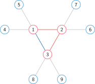

# 题意

这是目前的最简版题意，不知道有没有更好的。

---

给定一张无向无权简单图 $G=(V,E)$，你要求 $k$ 的最小值，使得它满足：

可以构造一个矩阵

$$
\begin{bmatrix}
x_{1,1}&x_{1,2}&\ldots&x_{1,k}\\
x_{2,1}&x_{2,2}&\ldots&x_{2,k}\\
\vdots&\vdots&\ddots&\vdots\\
x_{m,1}&x_{m,2}&\ldots&x_{m,k}\\
\end{bmatrix}
$$

满足下列条件：

- $\forall 1\le i<m,\sum_{j=1}^k[x_{i,j}\ne x_{i-1,j}]=1$
- 设 $S_0=\{1,2,\ldots,n\},S_i=\{p\mid p\in V,\exists a=(a_1,a_2,\ldots,a_k=p),\forall 1\le j\le k,x_{i,j}\notin a,\forall1\le l<k,(a_l,a_{l+1})\in E\}$  
	那么 $S_m=\varnothing$

# 进度

我们把问题分成以下几个部分，然后分别讨论最新的进展：

- 判定 $k=2$ 是否存在可行构造【$k=2$ 判定性】
	- 保证图是一棵树【Subtask Tree】**已解决**
	- 保证图是一棵仙人掌【Subtask Cactus】
	- 没有特殊限制【Subtask k=2】
- 保证图是一棵树【Task Tree】
- 证明或证伪，这个玩意是 NPC / NPH 的
- 没有特殊限制

# Subtask Tree

**猜想一：对于一棵 $k=2$ 的树，一定存在一种构造矩阵的方式，使得 $x_{1,1},x_{2,1},\ldots,x_{m,1}$ 互不相同。（感觉挺好证的？）**

根据上面的猜想，我们可以得到一个做法：

::: spoiler 做法
对于图 $G=(V,E)$ 和三个点 $x,y,z$，如果 $(x,y),(y,z)\in E,\operatorname{deg}(x)=1,\operatorname{deg}(y)=2$，那么我们定义 compress 操作为：删除 $(x,y),(y,z)$ 这两条边和 $y$ 点，然后添加一条边 $(x,z)$。

*注意删除的是 $y$ 而不是 $x$，而且这个定义与 Top tree 里的不一样*

如果我们对一棵 $k=2$ 的树一直进行 compress 操作，那么它会变成一棵「类毛毛虫」。

具体的，如果我们把 compress 之后的树的直径删掉，那么剩下的连通块一定是长度为 $1$ 或 $3$ 的链。
:::

# Subtask Cactus

猜想一在这里并不成立，但是我们先考虑猜想一成立的情况。

## 图满足猜想一

首先，如果仙人掌的圆方树中，所有的方点不在一条链上，那么显然无解。

然后我们考虑一个例子：

该图的一个合法解如下所示：

:::dividerL

:::	
:::dividerR or
$\begin{bmatrix}1&4\\1&1\\1&5\\1&1\\1&2\\1&6\\1&2\\3&2\\3&7\\3&2\\3&3\\3&8\\3&3\\3&9\end{bmatrix}$
:::

然后我们把这个解法里，红点（$x_{1,1},x_{2,1},\ldots,x_{m,1}$）走的路径和剩下的连通块标记出来：

可以注意到下面的一些东西：

1. 红点的移动路径是 $[1,3]$（这是一个序列，不是一个区间）
2. 蓝点经过 $4,5$ 时，红点都一直待在 $1$，对应的移动路径区间是 $[1,1]$
3. 蓝点经过 $2,6,7$ 时，红点经过了 $2,3$，对应的移动路径区间是 $[1,2]$
4. 蓝点经过 $8,9$ 时，红点都一直待在 $3$，对应的移动路径区间是 $[2,2]$
5. $[1,1],[1,2],[2,2]$ 只在端点处相交

然后我们考虑一个失败的红点路径：

可以注意到下面的一些东西：

1. 红点的移动路径是 $[1,2,3]$（这是一个序列，不是一个区间）
2. 蓝点经过 $4,5$ 时，红点都一直待在 $1$，对应的移动路径区间是 $[1,1]$
3. 蓝点经过 $6,7$ 时，红点都一直待在 $2$，对应的移动路径区间是 $[2,2]$
4. 蓝点经过 $8,9$ 时，红点都一直待在 $3$，对应的移动路径区间是 $[3,3]$
5. 红点从 $1$ 出发之后，到达 $3$ 之前，蓝点必须待在 $3$。或者说：  
	蓝点经过 $3$ 时，红点经过了 $1,2,3$，对应的移动路径区间是 $[1,3]$
6. **$[2,2]$ 和 $[1,3]$ 在 $2$ 处相交，且不在 $[1,3]$ 的端点上。** 或者说：  
	当红点在 $2$ 的时候，蓝点必须同时在 $3$，或者 $6,7$ 中的一个，这推出了矛盾

所以这条路径是失败的。

那么题目就变成了，找到一条简单路径，使得拆掉这条路径之后，其它的连通块都是链（或者点），并且对应的区间只在端点处相交。

感觉挺能做的……？有时间我想想吧

## 图不满足猜想一

目前我发现的一种特例：

